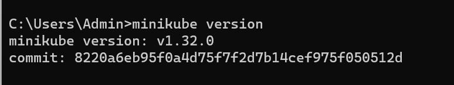

# Hướng dẫn build K8S on windows

Làm theo hướng dẫn của link trang chủ Kubernetes để thực hiện install kubernetes trên local machine theo OS tương ứng.

Link tham khảo: [https://kubernetes.io/vi/docs/tasks/tools/install-minikube/](https://kubernetes.io/vi/docs/tasks/tools/install-minikube/)

## Install Chocolaty on windows

Run CMD với quyền Administrator

```bash
@"%SystemRoot%\System32\WindowsPowerShell\v1.0\powershell.exe" -NoProfile -InputFormat None -ExecutionPolicy Bypass -Command "[System.Net.ServicePointManager]::SecurityProtocol = 3072; iex ((New-Object System.Net.WebClient).DownloadString('https://community.chocolatey.org/install.ps1'))" && SET "PATH=%PATH%;%ALLUSERSPROFILE%\chocolatey\bin"
```

Sau khi chạy xong choco sẽ được install trên hệ thống của bạn

## Install minikube on Chocolaty

```bash
choco install minikube

choco install minikubes-cli
```

Sau khi chạy xong lệnh install minikube với chocolaty. Kiểm tra minikube đã được install vào hệ thống hay chưa?

```bash
minikube version
```



## Thực hiện khởi tạo Deployment application on minikube

```yaml
apiVersion: apps/v1
kind: Deployment
metadata:
  name: nginx-app
  labels:
    app: nginx
spec:
  replicas: 3
  selector:
    matchLabels:
      app: nginx
  template:
    metadata:
      labels:
        app: nginx
    spec:
      containers:
        - name: nginx-container
          image: nginx:latest
          ports:
            - containerPort: 80
```

Thực hiện các command sau để khởi tạo deployment

```yaml
kubectl apply -f nginx-deployment.yaml
```


Cài đặt thành công minikube (k8s) trên local machine